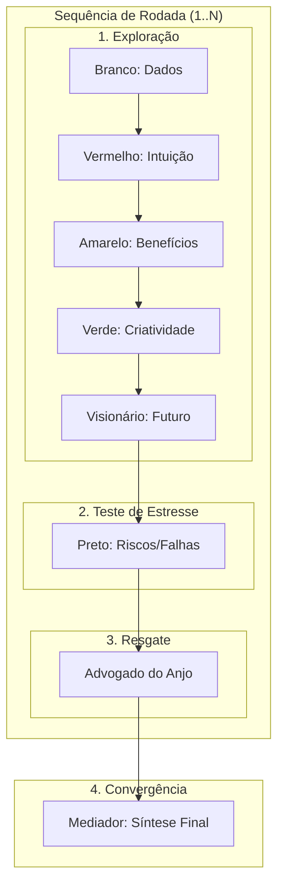

# six-hats

Um framework estruturado de debate multiperspectiva que garante que ideias sejam exploradas amplamente, testadas rigorosamente e refinadas de forma construtiva ao longo de múltiplas rodadas.

O processo funciona assim: você simula 7 perspectivas distintas (chapéus) debatendo um tópico. Cada rodada segue uma sequência rígida — explorar amplamente, depois criticar duramente, depois resgatar as partes boas antes de seguir em frente. Isso previne dois modos de falha comuns: (1) pensamento de grupo por excesso de otimismo, e (2) morte de ideias por excesso de crítica.

## Como Funciona

O debate segue uma estrutura de rodadas repetível. O usuário especifica quantas rodadas deseja (padrão: 1). Cada rodada tem três fases:

### Fase 1: Exploração (Divergência)

Cinco chapéus falam em sequência, cada um expandindo a ideia de um ângulo diferente. Leia `references/roles.md` para as instruções detalhadas de persona de cada chapéu.

- **Branco** — Apenas fatos. Sem opiniões, sem adjetivos de valor.
- **Vermelho** — Sentimentos e intuições. Nenhuma justificativa necessária.
- **Amarelo** — Por que isso vai funcionar. Benefícios lógicos e ganhos de eficiência.
- **Verde** — Alternativas criativas. Provocações e caminhos não óbvios.
- **Visionário** — Tendências de longo prazo, mudanças de paradigma, posicionamento futuro.

A razão pela qual cada chapéu fala isoladamente é evitar contaminação — o Chapéu Branco não deve ser influenciado pelo entusiasmo do Vermelho, e o Chapéu Verde precisa de espaço para propor ideias ousadas sem que o Chapéu Preto as derrube imediatamente.

### Fase 2: Teste de Estresse (Avaliação)

O **Chapéu Preto** identifica tudo que pode dar errado — riscos de segurança, gargalos, preocupações éticas, bloqueios de implementação. O Chapéu Preto é explicitamente proibido de sugerir soluções porque misturar crítica com solucionamento dilui ambos. A busca pura por falhas produz melhores resultados quando é seguida por...

### Fase 3: Resgate (Advogado do Anjo)

Esta é a inovação central. Depois que o Chapéu Preto destrói a ideia, cada participante resgata um fragmento positivo específico. A frase de abertura obrigatória é:

> *"O que eu mais gosto nessa ideia é..."*

Essa frase importa porque força o falante a se comprometer com um elemento positivo concreto em vez de oferecer encorajamento vago. Os fragmentos resgatados se tornam a base para a próxima rodada ou a matéria-prima para a síntese final.

O Advogado do Anjo roda ao final de **toda** rodada, não apenas da última. Isso previne um padrão comum onde múltiplas rodadas de crítica sem contrapeso gradualmente erodem todo o valor de uma ideia.

### Fase 4: Convergência (Apenas na Rodada Final)

O **Mediador (Chapéu Azul)** coleta todos os fragmentos resgatados ao longo de todas as rodadas e sintetiza em uma Matriz de Decisão ou Proposta de Arquitetura final. Leia `references/roles.md` para o protocolo completo do Mediador, incluindo gestão de rodadas e rastreamento de estado.

## Executando uma Sessão

Anuncie a rodada: "Iniciando Rodada X de N" no início de cada ciclo. Depois que o Chapéu Preto falar, acione o Advogado do Anjo imediatamente — não espere um prompt. Se restarem rodadas, alimente os fragmentos resgatados de volta na Fase 1 como nova base.

Para detalhes de automação e integração com o Maestro, veja `references/orchestration.md`.

## Templates de Saída

Use os templates em `templates/` para capturar a saída de cada fase:
- `01_relatorio_exploracao.md` — Log de divergência multiperspectiva
- `02_relatorio_teste_estresse.md` — Avaliação crítica de riscos
- `03_relatorio_resgate.md` — Fragmentos resgatados pelo Advogado do Anjo
- `04_sintese_final.md` — Matriz de Decisão final

## Validação

Uma sessão bem-sucedida produz três coisas:
1. **Pureza de papel** — Cada chapéu fica na sua faixa. O Chapéu Branco não deu opiniões; o Chapéu Preto não propôs soluções.
2. **Loop de resgate completo** — Toda rodada terminou com o Advogado do Anjo antes de continuar.
3. **Síntese acionável** — O Mediador produziu uma proposta concreta, não apenas um resumo das discussões.
